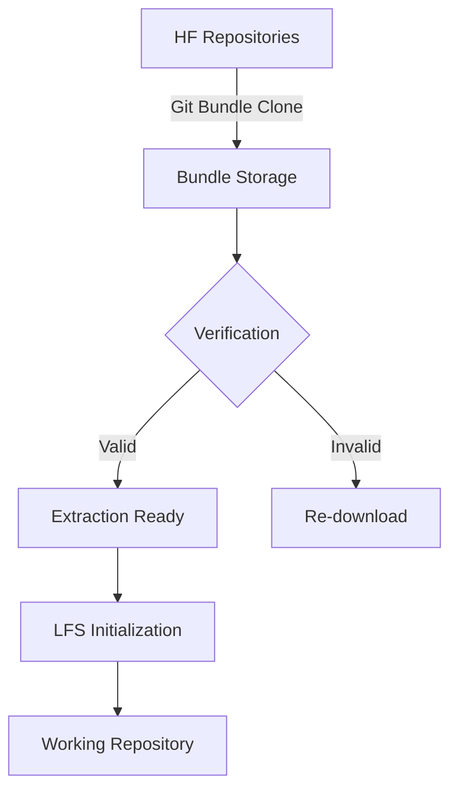

# DeepSeek Repository Manager

[](https://www.python.org/downloads/)
[](LICENSE)
[](https://huggingface.co/deepseek-ai)

A specialized tool for efficiently cloning and managing DeepSeek AI repositories from Hugging Face using Git bundle format.

## 📑 Table of Contents

- [Key Features](#-key-features)
- [Architecture](#-architecture)
- [Quick Start](#-quick-start)
- [Core Operations](#-core-operations)
- [Advanced Usage](#-advanced-usage)
- [Verification Process](#-verification-process)
- [Troubleshooting](#-troubleshooting)
- [Project Structure](#-project-structure)
- [Contributing](#-contributing)
- [License](#-license)
- [📜 Command Reference](#-command-reference)

## ✨ Key Features

- **Git Bundle Storage**: Stores repositories as Git bundles for efficient cloning
- **LFS Readiness Check**: Verifies LFS configuration before extraction
- **Selective Extraction**: Extract specific repositories on demand
- **Integrity Verification**: Validates bundle structure and completeness
- **Space Efficiency**: Bundles are 30-50% smaller than full clones
- **Windows Support**: Robust handling of file permissions and pathing

## 🏗️ Architecture



## 🚀 Quick Start

```bash
# Clone the manager
git clone https://github.com/rakshitbharat/deepseek-local-clone-helper.git
cd deepseek-local-clone-helper

# Install dependencies
pip install -r requirements.txt

# Download all repositories (uses Git bundle format)
python -m deepseek_manager.scripts.download_repos

# Verify repository bundles
python -m deepseek_manager.scripts.verify_repos

# Extract a specific repository
python -m deepseek_manager.scripts.selective_extract deepseek-ai/deepseek-coder-33b-instruct
```

## 🛠️ Core Operations

### Bundle Management
```bash
# List available repositories
python -m deepseek_manager.scripts.selective_extract --list

# Force re-download of all repositories
python -m deepseek_manager.scripts.download_repos --force

# Validate single repository
python -m deepseek_manager.scripts.verify_repos deepseek-ai/deepseek-coder-33b-instruct
```

### Space Optimization
```bash
# Clean extracted repositories
python -m deepseek_manager.scripts.cleanup --remove-extracted

# Remove invalid bundles
python -m deepseek_manager.scripts.cleanup --remove-invalid

# Estimate storage needs
python -m deepseek_manager.scripts.storage_report
```

## 🔍 Verification Process

The verification system checks:
1. Bundle file integrity
2. Git object consistency
3. LFS configuration
4. Metadata completeness
5. File permission validity

Sample verification output:
```text
Verifying 68 repositories...

✅ Valid Bundles: 65
❌ Invalid Bundles: 3
⚠️  LFS Warnings: 12

Issues Detected:
- deepseek-ai/deepseek-coder-33b-instruct: 
  • Missing LFS endpoint configuration
  • 2 invalid object references
```

## 🚨 Troubleshooting

### Common Issues

**Bundle Verification Failed**
```bash
# Re-download specific repository
python -m deepseek_manager.scripts.download_repos --repo deepseek-ai/deepseek-coder-33b-instruct
```

**Permission Denied Errors**
```bash
# Reset file permissions
python -m deepseek_manager.scripts.cleanup --fix-permissions
```

**LFS Configuration Missing**
```bash
# Initialize LFS after extraction
git lfs install
cd extracted/deepseek-ai/deepseek-coder-33b-instruct
git lfs pull
```

## 📂 Project Structure

```
deepseek_manager/
├── scripts/
│   ├── download_repos.py    # Bundle creation
│   ├── verify_repos.py      # Integrity checks
│   ├── selective_extract.py # Partial extraction
│   └── cleanup.py           # Maintenance tasks
├── utils/
│   └── common.py            # Shared utilities
├── docs/
│   └── prompts/            # System prompts
└── deepseek_storage/
    ├── bundles/             # Git bundle storage
    └── extracted/          # Active repositories
```

## 🤝 Contributing

We welcome contributions! Please see our [Contribution Guide](CONTRIBUTING.md) for:
- Issue reporting guidelines
- Development setup instructions
- Code style requirements
- PR submission process

## 📄 License

MIT License - See [LICENSE](LICENSE) for full text.

## 📜 Command Reference

### Core Scripts

| Command | Description | Options |
|---------|-------------|---------|
| `download_repos` | Download repositories as Git bundles | `--force` Force re-download<br>`--repo <id>` Download specific repo |
| `verify_repos` | Validate repository bundles | `--fix` Attempt automatic repairs<br>`--detailed` Full validation report |
| `selective_extract` | Manage repository extraction | `--list` Show available repos<br>`--validate` Check extraction readiness |
| `cleanup` | Maintenance operations | `--remove-extracted` Delete extracted copies<br>`--remove-invalid` Purge bad bundles |

### Utility Scripts

```bash
# Generate storage report
python -m deepseek_manager.scripts.storage_report

# Check system dependencies
python -m deepseek_manager.scripts.check_environment

# Migrate old archives to bundle format
python -m deepseek_manager.scripts.migrate_archives

# Generate API documentation
python -m deepseek_manager.scripts.generate_docs
```

### Advanced Options

```bash
# Set custom storage path
DEEPSEEK_STORAGE=/custom/path python -m deepseek_manager.scripts.download_repos

# Enable debug logging
python -m deepseek_manager.scripts.download_repos --log-level DEBUG

# Parallel downloads (4 workers)
python -m deepseek_manager.scripts.download_repos --workers 4

# Dry run (simulate operations)
python -m deepseek_manager.scripts.cleanup --dry-run
```

### Configuration File

Create `config.yaml` in project root:

```yaml
storage:
  path: /custom/storage/path
  max_size: 100GB
  
network:
  timeout: 30
  retries: 5
  parallel_downloads: 4
  
logging:
  level: INFO
  file: deepseek.log
```

---

💡 **Pro Tip**: Use `--help` with any script for detailed usage information:
```bash
python -m deepseek_manager.scripts.download_repos --help
```

# DeepSeek Manager

A complete solution for managing DeepSeek AI models locally

## Features
- Download models from Hugging Face
- Verify model integrity
- Extract models for local use
- Run models with different configurations

## Prerequisites
- Python 3.10+
- Git LFS
- 8TB+ free disk space (for full repository set)
- NVIDIA GPU (recommended)
- 8GB+ RAM (16GB+ for larger models)

## Quick Start

```bash
# Install requirements
pip install -r requirements.txt

# Download the smallest model (1.3B)
python -m deepseek_manager.scripts.download_repos

# Extract the model
python -m deepseek_manager.scripts.selective_extract

# Run inference
python -m deepseek_manager.scripts.run_model
```

## Advanced Usage

```bash
# Download specific model
python -m deepseek_manager.scripts.download_repos --repo deepseek-ai/deepseek-coder-7b-instruct

# Verify archives
python -m deepseek_manager.scripts.verify_archives

# Extract specific model
python -m deepseek_manager.scripts.selective_extract deepseek-ai_deepseek-coder-7b-instruct

# Run with different options
python -m deepseek_manager.scripts.run_model \
  --model deepseek-coder-7b-instruct \
  --quant 4bit \
  --max-tokens 500

# Check actual repository sizes
python -m deepseek_manager.scripts.repo_sizes --sort desc --top 10

# Display repository sizes
python -m deepseek_manager.scripts.repo_sizes --sort desc --top 10
```

## Script Overview

| Script                  | Description                                                                 |
|-------------------------|-----------------------------------------------------------------------------|
| `download_repos.py`     | Download models from Hugging Face (7.27TB total for all repositories)       |
| `selective_extract.py`  | Extract downloaded models                                                   |
| `verify_archives.py`    | Validate downloaded model bundles                                           |
| `repo_sizes.py`         | Display accurate repository sizes (e.g. 641GB for DeepSeek-R1 repositories) |
| `run_model.py`          | Run inference on extracted models                                              |

## Features
- Download models from Hugging Face
- Manage large repositories:
  - DeepSeek-R1: 641.31GB
  - DeepSeek-V2-Chat: 439.11GB
  - deepseek-coder-33b-instruct: 124.21GB
- Verify model integrity
- Extract models for local use
- Run models with different configurations 